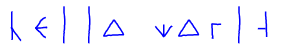

# React-Runic
View the [demo here](https://ksaxberg.github.io/react-runic)

[](https://www.npmjs.com/package/react-runic)
[](https://www.npmjs.com/package/react-runic)
## Summary
An easy way to create some runic text. Apply css styles to customize the runic svgs. There are two modes, either single letters or compound letters. A compound letter would be combining something like "th" into a single glyph. 

Currently supported characters are `[a-zA-Z ]*`, all other characters are removed.

## Usage
```js
import { Runic } from 'react-runic';

const Component extends React.Component {
  render() {
    return (
      <div style={{color: "lightblue"}}>
        <Runic
          size="35"
          text="Hello World"
          singleLetters
        />
      </div>
    );
  }
}
```

Will render the following: 
<center>
    
</center>
